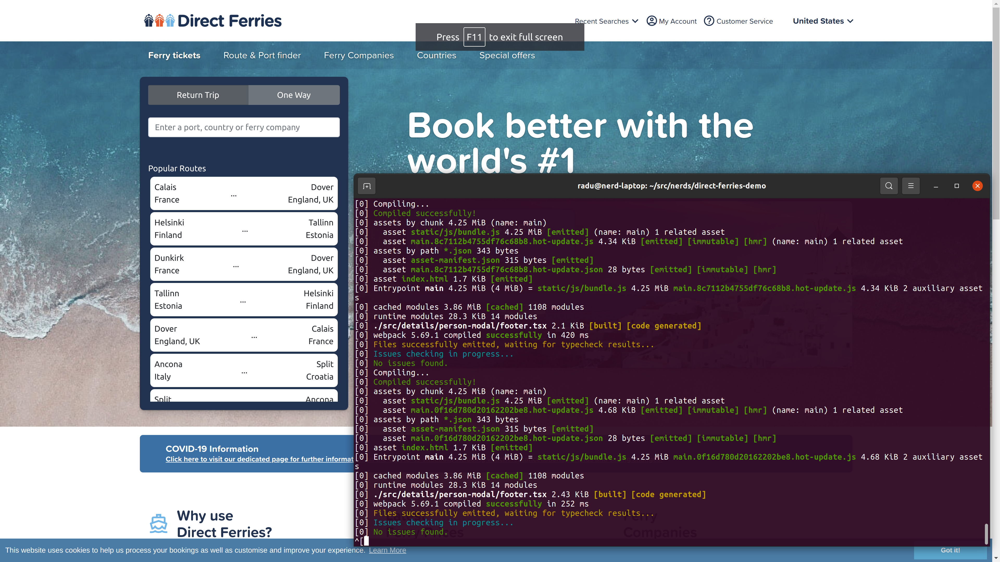

## ...

A small react project used for demo purposes.

### Requirements

Stuff needed to be met before the development process.

* __Node.js__
* __yarn__
* __Google Chrome v98.0__
* __Unix like terminal__

### Run

Stuff needed to be done in order to run the project.

* Clone the project
  * `git clone ...`
* Install the dependencies
  * `yarn install`
* Start the project
  * `yarn start`
* Check the browser
  * `http://localhost:9000/` 

### Test

Stuff needed to be done in order to run tests.

* Run unit tests
  * `yarn test:unit`
* Start the project
  * `yarn start`
* Run e2e tests
  * `yarn test:e2e`

### Lint

Stuff needed to be done in order to lint the code.

* Try to auto-fix the issues
  * `yarn lint:fix`
* Solve the remained issues
  * `by your hand`
* Commit and push the changes
  * `git commit ... && git push ...`
